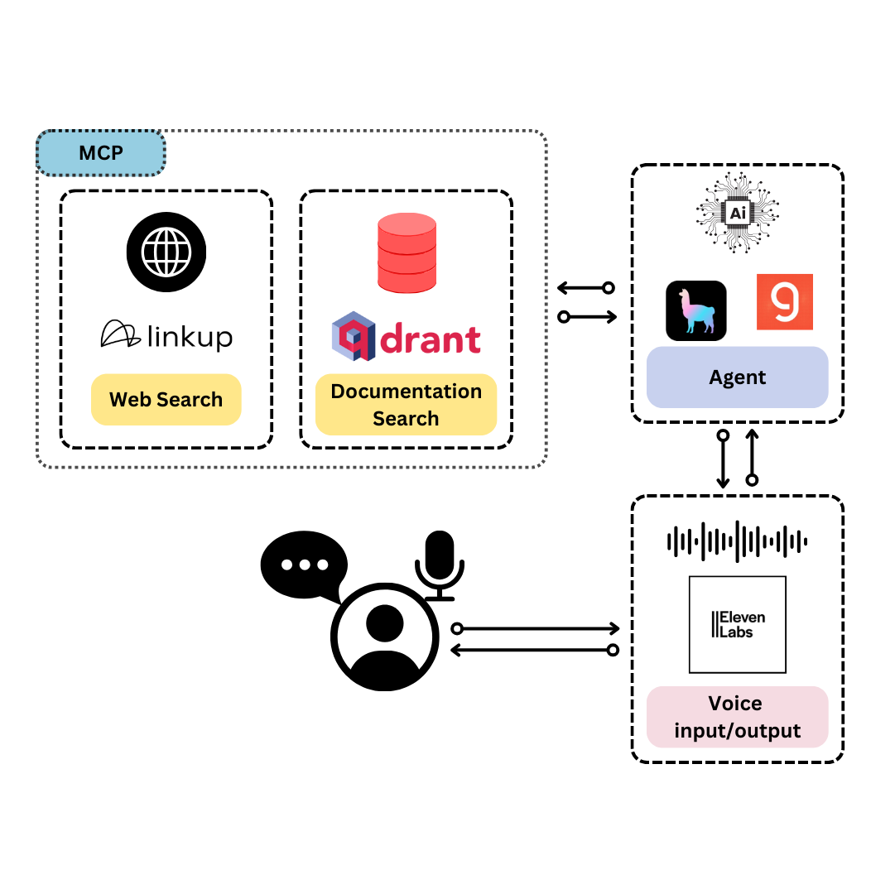

<h1 align="center">TySVA - TypeScript Voice Assistant🪄</h1>

<h2 align="center">Learn TypeScript chatting effortlessly with AI</h2>

<div align="center">
    <h3>If you find TySVA userful, please consider to donate and support the project:</h3>
    <a href="https://github.com/sponsors/AstraBert"></a>
</div>
<br>
<div align="center">
    
</div>
<br>

**TySVA** is aimed at creating a learning space for you to get to know more about TypeScript, leveraging:

- [Qdrant](https://qdrant.tech) local database, with the full documentation for TypeScript
- [LinkUp](https://linkup.so/), for web deep search
- [MCP servers](https://modelcontextprotocol.io/introduction), for vector search and web search automation
- [ElevenLabs](https://elevenlabs.io/), for voice input transcription and voice output generation
- [LlamaIndex](https://www.llamaindex.ai), for agent workflows

It supports voice input/output, as well as textual input/output. 

## Install and launch🚀

The first step, common to both the Docker and the source code setup approaches, is to clone the repository and access it:

```bash
git clone https://github.com/AstraBert/TySVA.git
cd TySVA
```

Once there, you can choose one of the two following approaches:

### Docker (recommended)🐋

> _Required: [Docker](https://docs.docker.com/desktop/) and [docker compose](https://docs.docker.com/compose/)_

- Add the `groq_api_key`, `elevenlabs_api_key` and `linkup_api_key` variable in the [`.env.example`](./.env.example) file and modify the name of the file to `.env`. Get these keys:
    + [On Groq Console](https://console.groq.com/keys)
    + [On ElevenLabs Settings](https://elevenlabs.io/app/settings/api-keys)
    + [On Linkup Dashboard](https://app.linkup.so/api-keys)

```bash
mv .env.example .env
```

- Launch the Docker application:

```bash
# If you are on Linux/macOS
bash start_services.sh
# If you are on Windows
.\start_services.ps1
```

- Or do it manually:

```bash
docker compose up vector_db -d
docker compose up mcp -d
docker compose up app -d
```

You will see the application running on http://localhost:7999/app and you will be able to use it. Depending on your connection and on your hardware, the set up might take some time (up to 15 mins to set up) - but this is only for the first time your run it!

### Source code🗎

> _Required: [Docker](https://docs.docker.com/desktop/), [docker compose](https://docs.docker.com/compose/) and [conda](https://anaconda.org/anaconda/conda)_

- Add the `groq_api_key`, `elevenlabs_api_key` and `linkup_api_key` variable in the [`.env.example`](./.env.example) file and modify the name of the file to `.env`. Get these keys:
    + [On Groq Console](https://console.groq.com/keys)
    + [On ElevenLabs Settings](https://elevenlabs.io/app/settings/api-keys)
    + [On Linkup Dashboard](https://app.linkup.so/api-keys)

```bash
mv .env.example scripts/.env
```

- Set up the conda environment and the vector database using the dedicated script:

```bash
# For MacOs/Linux users
bash setup.sh
# For Windows users
.\setup.ps1
```

- Or you can do it manually, if you prefer:

```bash
docker compose up vector_db -d

conda env create -f environment.yml
```

- Now you can launch the script to load TypeScript documentation to the vector database:

```bash
conda activate typescript-assistant-voice
python3 scripts/data.py
```

- And, when you're done, launch the MCP server:


```bash
conda activate typescript-assistant-voice
cd scripts
python3 server.py
```

- Now open another terminal, and run the application:

```bash
uvicorn app:app --host 0.0.0.0 --port 7999
```

You will see the application running on http://localhost:7999/app and you will be able to use it.

## Workflow



The workflow is very simple:

- When you submit a request, if is audio, it gets transcribed and then submitted to the agent workflow as a starting prompt, whereas if it is textual it will be submitted directly to the agent workflow
- The agent workflow can solve the TypeScript answer by retrieving documents from the vector database or by searching the web. There is also the possibility of a direct response (no tool use) if the answer is simple. All the tools are available through MCP. 
- Once the agent is done, the agentic process and the output get summarized, and the summaries are turned into voice output. The voice output is returned along with the textual output by the agent.

## Contributing

Contributions are always welcome! Follow the contributions guidelines reported [here](CONTRIBUTING.md).

## License and rights of usage

The software is provided under MIT [license](./LICENSE).
